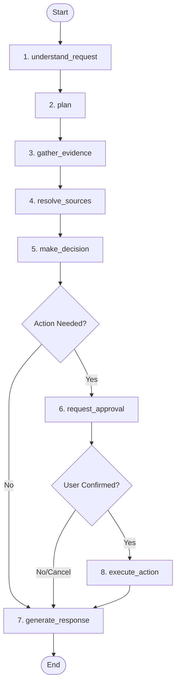

# ParcelPilot Operations & Support Copilot: Submission Notes

This document contains the **Architecture Note**, **Product Note**, and **Setup/Verification Guide** for the ParcelPilot Copilot application.

---

## 1. Architecture Note

### Agent & Workflow Design (LangGraph)
The core reasoning engine is built using **LangGraph** to model a multi-step state machine (`AgentState` TypedDict). This approach was chosen over a single-turn LLM agent loop because customer support and operations in logistics require strict guidelines, structured data retrieval, and deterministic paths.



#### Graph Nodes:
1. **`understand_request`**: Classifies user message intent (e.g., `cancellation_check`, `credit_check`, `general_question`) and parses relevant entities (`order_id`, `customer_name`) using Gemini 3.6 Flash.
2. **`plan`**: Formulates a plan of actions/tools needed based on the intent.
3. **`gather_evidence`**: Retrieves operational facts (scopes SQL lookup by active account) and policy guides (semantic vector query in Qdrant).
4. **`resolve_sources`**: Compiles all documents and resolves guidelines by **authority order**.
5. **`make_decision`**: Evaluates facts against resolved policies to approve/deny actions.
6. **`request_approval`**: Halts execution, registers a proposed action state, and prompts confirmation in the UI.
7. **`execute_action`**: Executes the approved state-changing action (e.g., updates SQLite cancel state).
8. **`generate_response`**: Synthesizes the final markdown text and trace log (streams tokens to SSE queue).

---

### Tool Design & Data Enforcements
The agent interacts with three custom tools developed at the controller layer:
* **Vector Semantic Search (Qdrant Cloud)**: Embeds guidelines using `all-MiniLM-L6-v2` and searches policy guides/SOPs/customer agreements.
* **Structured Data Lookup (SQLite)**: Scopes all queries (`get_accounts`, `get_orders`, `get_tickets`) at the Python/SQL layer using the trusted session boundary (`session_state["account_id"]`). **Security is enforced programmatically in Python**, rather than relying on system instructions (preventing prompt injection leaks).
* **State-Changing Actions**: Implemented local SQL transaction updates for order cancellation, applying service credits, and ticket escalation.

---

### Trust & Conflict Resolution (Authority System)
To prevent "hallucinatory entitlement promises" and address conflicting policies, we implemented a structured **Authority Rank Resolution System**:
* Each policy source is cataloged with an authority level:
  - **Level 100 (Highest)**: Customized Customer Agreements (e.g., `northstar_agreement.md`).
  - **Level 50 (Medium)**: Product Operations Guides (e.g., `product_operations_guide.md`).
  - **Level 10 (Lowest)**: Standard Support Policies and SOPs (e.g., `cancellation_service_credit_sop_v4.md`).
* When guidelines conflict (e.g., default policy charges INR 250 cancellation fee but Northstar agreement waives it), the guidelines are sorted by authority descending. The agent evaluates the decision using the highest-ranked policy constraint.

---

## 2. Product Note

### Addressing Trust & Reliability
To build operational trust, we focused on **transparency** and **human-in-the-loop validation**:
1. **Execution Trace**: Every response explicitly renders the steps, tools used, and policy references in a visual trace logs drawer. Support agents know exactly *why* a decision was made.
2. **Uncertainty Fallback**: Under the default SOP, credits cannot be promised if details are unknown. If the user query is missing an order ID or details, the agent declines automatically, declaring `insufficient_information` and redirecting to human channels.
3. **Two-Stage Confirmation**: Actions (like canceling an order) are prepared as a JSON payload, prompting the user with clear `Confirm` or `Cancel` controls before executing any database changes.

---

### Chosen Problem: Proactive Issue Detection (Roadmap)
If we were to extend this product for ParcelPilot, we would focus on **Proactive Issue Detection**:
* **Real-time Event Ingestion**: Feed live updates from carrier Webhooks (e.g., pickup delay logs) into a streaming consumer (Kafka/Redis).
* **Cron-scheduled Vector Clustering**: Run daily clustering over open tickets to group similar complaints and raise alerts for systemic bugs (e.g., "bulk upload failures on large CSVs").
* **SLA Breach Predictor**: A background task checking order pickup windows and automatically flagging orders that are within 30 minutes of breaching the 2-hour delay threshold, suggesting proactive CSM communication.

#### Key Metrics for Success:
* **Action Confirmation Rate**: Percentage of AI-proposed actions that are confirmed by human agents without modifications (aiming for $>90\%$).
* **Mean Time to Resolution (MTTR)**: Time taken to resolve ticket queries compared to manual search metrics.

---

## 3. Setup & Verification Guide

### Setup
1. **Initialize Virtual Env**:
   ```bash
   cd backend
   python -m venv venv
   .\venv\Scripts\activate
   pip install -r requirements.txt
   ```
2. **Initialize Database**:
   ```bash
   python database.py --force
   ```
3. **Run API Server**:
   ```bash
   uvicorn main:app --reload --host 127.0.0.1 --port 8000
   ```
4. **Run React Frontend**:
   ```bash
   cd ../frontend/parcelpilot
   npm install
   npm start
   ```

### Verification
* **Unit Tests**: Run `pytest` from the workspace root directory:
  ```bash
  .\backend\venv\Scripts\pytest.exe backend/tests/test_api.py -v
  ```
* **Real-Time Streaming**: Start uvicorn and the React frontend, scope context to *Northstar Logistics*, and execute a query. You will observe process logs and tokens streaming dynamically onto the chat dashboard.

---

## 4. AI Tool Usage

The following AI coding tools were used during this project:

| Tool | How It Was Used |
|---|---|
| **Antigravity IDE** (Google DeepMind) | Primary development assistant — used for code generation, debugging, iterative refactoring, and architectural decisions across the FastAPI backend, LangGraph agent pipeline, SQLite data layer, Qdrant vector search integration, and React frontend. |
| **Claude Sonnet** (Anthropic) | Used for reasoning through complex architectural decisions, reviewing code structure, and refining product thinking during development. |
| **Google Gemini 2.5 Flash** | LLM powering all agent nodes at runtime — intent parsing, multi-step planning, source resolution, decision making, and final response generation. |

AI tools were used extensively to accelerate development. All architectural decisions, product choices, and code structure were reviewed and directed by V Abhijith.
